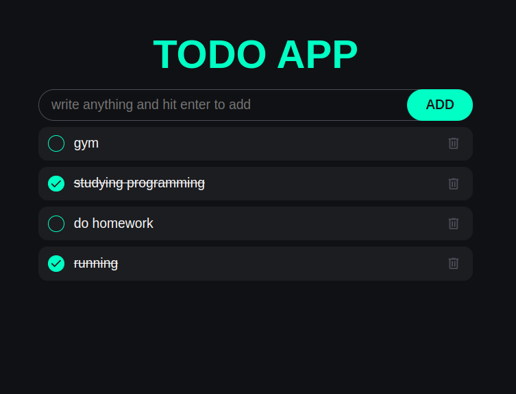

# TODO APP

## Objective
Practice on localStorage in javascript
enter and save a item in local storage
and you can also delete it

## Features
* you can enter a todo
* you can delete a todo

## Future Features
* Edit this todo
* change UI
* Add profile for each user
* Add timer for todos
* ...

## Sample Todo
</img>